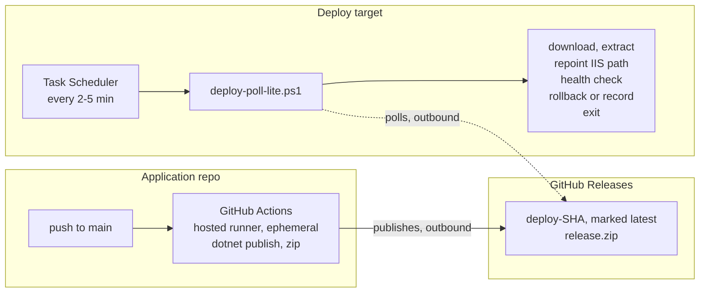

# Hermes

Pull-based IIS deployment for a Windows VM that cannot host a CI agent.

[](https://github.com/RyeT7/Hermes/actions/workflows/tests.yml)

A stateless PowerShell script, fired by Task Scheduler every few minutes, that
pulls the latest build from GitHub Releases, swaps it into IIS, health-checks
it, and rolls back automatically if the site doesn't come up. It leaves nothing
running between deploys.

> **Note:** this repo contains the *deploy pipeline only*. The application it
> deploys lives in its own repository — see [Setup](#setup).

---

## Why not Jenkins or a self-hosted runner?

The design targets a shared, memory-constrained production Windows host that
accepts no inbound connections from outside its network. Two constraints follow:

- **No persistent process may run on the target.** A long-lived agent that can
  grow in memory over time isn't an acceptable risk on a shared production
  host. That rules out Jenkins, and also a self-hosted GitHub Actions runner —
  lightweight, but still permanently resident.
- **Nothing may connect *inward*.** Outbound is fine; inbound is not available.

So nothing pushes to the target. It pulls, on its own schedule, and exits.
Builds happen on GitHub's free hosted runners; the target only ever downloads an
artifact and copies files. **It never compiles anything, and never touches other
services on the host.**

## How it works



Note the direction of both arrows: they *originate* from the app runner and from
the deploy target. Neither side ever connects to the other, and nothing ever
connects inward — GitHub is a durable hand-off point that both sides reach out
to.

Each deploy extracts into a fresh `release-<timestamp>` folder and repoints the
IIS site's physical path at it. Rollback is therefore just pointing the path
back at the previous folder — no re-download, no partial state.

## What's in this repo

| Path | Purpose |
|---|---|
| `deploy-poll-lite.ps1` | Entry point. The only thing Task Scheduler invokes. Orchestration only. |
| `lib\*.ps1` | The work, split by concern: `Logging`, `Config`, `Lock`, `GitHub`, `Iis`, `Releases`. Dot-sourced, never `Import-Module`. |
| `config.yaml` | All per-deployment settings. Reconfigure here, not in the script. |
| `tests\run-tests.ps1` | Unit tests for config parsing, the overlap guard, and release pruning. No Pester required. |
| `examples\deploy-release.yml` | **Template** for the *app repo's* build workflow. Not run from this repo. |

## Setup

### 1. In the application's repository

Copy [`examples/deploy-release.yml`](examples/deploy-release.yml) to
`.github/workflows/` there and set `PROJECT_PATH` to the real `.csproj`.

Four things must match the VM's `config.yaml` or the poller silently never
deploys:

| Requirement | Why |
|---|---|
| Asset named `release.zip` | Must equal `release_asset_name` |
| Release marked `--latest` | The poller reads `/releases/latest` |
| Tag `deploy-<sha>` | Compared against the recorded state to detect "new" |
| Archive root **is** the web root | IIS points straight at the extracted folder |

That last one is the easy mistake: zip the *contents* of the publish output
(`cd publish && zip -r ../release.zip .`), not the folder. Nesting it one level
down means IIS finds no `web.config`, the health check fails, and the deploy
rolls back.

### 2. On the deploy VM

Copy **the whole folder** — the script needs `lib\` and `config.yaml` beside
it. It verifies the full lib set at startup and exits `2` before touching IIS
if anything is missing, but don't rely on that; copy it as a unit.

Then edit `config.yaml`:

```yaml
github_owner: <your-org>
github_repo: <app-repo-name>
iis_site_name: <IIS site name>
health_url: http://localhost/health
deploy_root: C:\inetpub\deployments\<app>
```

Run it once by hand to confirm it works before scheduling it.

### 3. Register the scheduled task

```
schtasks /create /tn "Hermes Deploy Poll" /sc minute /mo 3 /ru SYSTEM ^
  /tr "powershell.exe -NoProfile -ExecutionPolicy Bypass -File \"C:\deploy\deploy-poll-lite.ps1\""
```

⚠️ Then open the task's **Settings** tab and tick **"If the task is already
running, do not start a new instance."** `schtasks` cannot set this from the
command line. It's a second line of defense alongside the script's own lock
file, not a replacement for it.

Keep the interval longer than a worst-case run (download + extract + health
retries), or most polls just hit the overlap guard and skip — harmless, but
noisy in the log.

## Configuration

| Key | Default | Notes |
|---|---|---|
| `github_owner` | — | **Required.** |
| `github_repo` | — | **Required.** The *app's* repo. |
| `release_asset_name` | `release.zip` | Must match what CI attaches. |
| `github_token` | *(blank)* | Only for private repos. See [Limitations](#limitations). |
| `iis_site_name` | — | **Required.** |
| `health_url` | — | **Required.** Must return 200 only when genuinely ready. |
| `deploy_root` | — | **Required.** Same volume as the site. |
| `log_file` / `lock_file` / `state_file` | under `deploy_root` | |
| `health_retries` | `10` | |
| `health_retry_delay_seconds` | `3` | `retries × delay` must exceed cold-start time. |
| `keep_releases` | `5` | Live and previous release are never pruned. |
| `lock_stale_minutes` | `30` | Locks older than this are treated as abandoned. |
| `http_timeout_seconds` | `120` | |

The parser is a deliberately minimal flat `key: value` reader — no nesting, no
lists — so the VM needs no third-party YAML module.

> **`health_url` is the single most important setting.** The rollback decision
> depends entirely on it being honest about readiness. An endpoint that returns
> 200 before the app can serve traffic will let broken deploys through.

## Operating it

Status lives in `deploy.log` under `deploy_root`. There is no dashboard and no
notifications yet.

```powershell
Get-Content C:\inetpub\deployments\<app>\deploy.log -Tail 40 -Wait
```

Routine polls that find nothing new are intentionally **not** logged — at a
3-minute interval that would bury everything that matters.

**Exit codes**

| Code | Meaning |
|---|---|
| `0` | Nothing to do, or deploy succeeded |
| `1` | Deploy failed, site was rolled back |
| `2` | Couldn't start: incomplete install, bad config, IIS unavailable, GitHub unreachable |

**Force a redeploy** of the current release:

```powershell
.\deploy-poll-lite.ps1 -Force
```

**When a health check fails**, the script repoints IIS at the previous release
and re-checks it. The state file is deliberately left untouched, so the next
tick retries the same tag rather than marking a failed release as deployed.
If rollback *also* fails to restore health, the log says so explicitly and the
site needs manual attention.

**To verify the memory-safety property** this design exists for: watch
`Get-Process powershell` during a manual run. It should spike briefly during
`Expand-Archive` and drop to nothing the instant the script exits.

## Testing

```powershell
.\tests\run-tests.ps1
```

Covers config parsing, the overlap guard, and release pruning — everything that
needs no GitHub, IIS, or network. Exits non-zero on failure. Run it on a dev
machine, not the VM.

`lib\Iis.ps1` and `lib\GitHub.ps1` require real IIS and a real network, so CI
only syntax-checks them.

## Requirements

- Windows PowerShell 5.1 (CI pins to this, not PowerShell 7)
- IIS with the `WebAdministration` module (IIS management tools)
- Permission to modify the target site's configuration
- Outbound HTTPS to `github.com` and `api.github.com`

## Limitations

Known and deliberate:

- **No notifications.** A failed deploy is only visible in the log. A webhook is
  the highest-value next addition.
- **No approval gate.** This is continuous *deployment* — every release ships
  automatically.
- **One app per config.** A second app means a second `config.yaml` and a second
  scheduled task, not a fork of the script.
- **Private repo support is unverified.** The code path is written and handles
  the S3 redirect correctly, but has never been run against a real private repo.

## License

Apache License 2.0 — see [LICENSE](LICENSE) for the full text.

Copyright 2026 Ryuu Stanley Tistogondo
